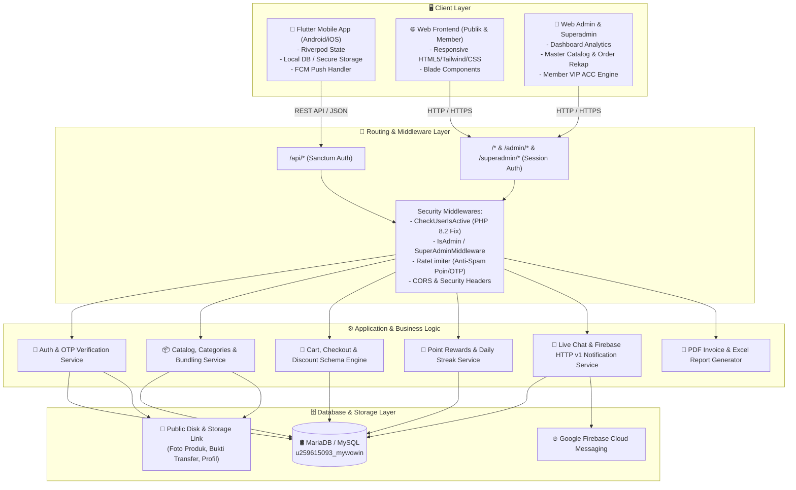
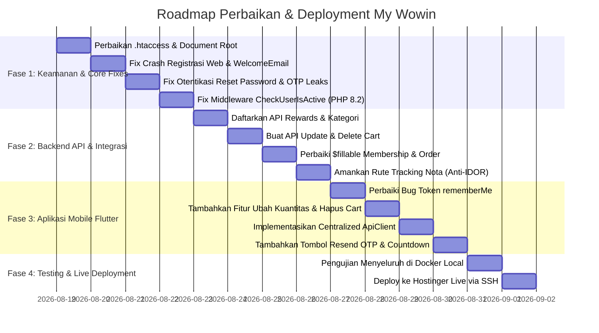

# 🏗️ BLUEPRINT ARSITEKTUR & STRATEGI PERBAIKAN TOTAL: MY WOWIN
**Platform E-Commerce & Membership Terintegrasi (Flutter Mobile, Web Laravel 12, & Backend API)**

---

## 📌 1. EXECUTIVE SUMMARY & ARSITEKTUR SISTEM

Sistem **My Wowin** adalah ekosistem e-commerce dan manajemen kemitraan (B2C & B2B Mitra) yang terdiri dari:
1. **Aplikasi Mobile (Flutter)**: Aplikasi konsumen/mitra untuk belanja produk, klaim promo bundling, pengumpulan poin reward harian, live chat CS, pengajuan upgrade status mitra VIP, dan pelacakan pesanan.
2. **Web Frontend (Laravel Blade)**: Portal publik untuk pengunjung web, registrasi mitra dengan verifikasi email OTP, belanja online, tracking nota, dan pusat informasi (artikel, promo, FAQ).
3. **Web Backend & Admin Panel (Laravel 12 / PHP 8.2+)**: Panel kendali terpisah untuk **Super Admin** (pusat) dan **Admin Cabang** (per PT/Kantor Cabang: Trenggalek, Kediri, Madiun, Solo, Jogja, Cirebon, Kudus, Bogor, Serang) dengan fitur rekap pesanan, cetak invoice PDF/Excel, approval kemitraan, dan live chat.
4. **Infrastruktur & Deployment**:
   - **Local Environment**: Docker Compose (PHP 8.2 FPM, Nginx, MariaDB 10.11, phpMyAdmin).
   - **Production Server**: Hostinger Shared/Cloud Hosting via SSH Deployment (`46.202.139.14:65002`).



---

## 📱 2. SPESIFIKASI APLIKASI MOBILE (FLUTTER)

### 2.1. Arsitektur & State Management
* **State Management**: **Riverpod 2.0+** (`Notifier` / `AsyncNotifier` / `NotifierProvider`).
* **Network Layer**: Standarisasi menggunakan `ApiClient` terpusat yang otomatis menyematkan header `Authorization: Bearer <token>`, menangani refresh token, dan menangkap HTTP exception (401, 403, 404, 422, 500).
* **Storage Kredensial**: Menggunakan `SharedPreferences` terenkripsi / `flutter_secure_storage` untuk menyimpan `auth_token`, user session, dan cache ringan.

### 2.2. Modul Fitur Aplikasi Pengunjung & Member

| Modul | Deskripsi Alur & UI/UX | Backend API Terkait |
| :--- | :--- | :--- |
| **Autentikasi & Registrasi** | Form registrasi lengkap (Nama, Toko, Alamat, No HP, Cabang) ➡️ Pengiriman OTP ke email ➡️ Layar Verifikasi 6 Digit OTP dengan tombol **Kirim Ulang (Timer 60s)** ➡️ Auto-login setelah OTP valid. | `POST /api/register`<br/>`POST /api/verify-otp`<br/>`POST /api/login`<br/>`POST /api/forgot-password-otp`<br/>`POST /api/reset-password` |
| **Marketplace & Katalog** | Slider Hero Banner interaktif, Quick Category Filter, Daftar Produk Reguler (Pcs / Karton), Banner Promo Bundling Spesial, Search Bar real-time, dan Halaman Detail Produk/Promo. | `GET /api/heroes`<br/>`GET /api/categories`<br/>`GET /api/bundlings`<br/>`GET /api/catalog` |
| **Keranjang Belanja (Cart)** | Menampilkan item reguler & bundling, fitur **Tambah/Kurang Jumlah (+/-)**, tombol **Hapus Item**, perhitungan subtotal dinamis, dan validasi stok/unit. | `GET /api/cart`<br/>`POST /api/cart`<br/>`PATCH /api/cart/{id}` *(Baru)*<br/>`DELETE /api/cart/{id}` *(Baru)*<br/>`POST /api/carts/addBundling` |
| **Checkout & Pemesanan** | Modal BottomSheet pemilihan metode bayar (Transfer Bank, COD, WhatsApp CS), input catatan pengiriman, kalkulasi diskon otomatis berdasarkan level membership mitra, dan pembuatan invoice unik (`INV-XXXXXX`). | `POST /api/checkout` |
| **Program Poin Rewards** | Tampilan saldo poin, riwayat login streak 30 hari, daftar hadiah reward, filter reward, dialog cara kerja, dan tombol klaim reward (terproteksi verifikasi server). | `GET /api/profile`<br/>`POST /api/claim-reward`<br/>`GET /api/rewards`<br/>`POST /api/rewards/claim` |
| **Live Chat CS** | Ruang obrolan real-time antara member dan CS/Super Admin dengan Optimistic UI, auto-scroll ke pesan terbaru, dan integrasi notifikasi push Firebase saat ada balasan admin. | `GET /api/chats`<br/>`POST /api/chats` |
| **Riwayat & Detail Pesanan** | Daftar riwayat status pesanan (*Pending, Lunas, Dikirim, Selesai, Batal*), kartu rincian produk, total tagihan, e-nota, dan tombol hubungi Admin Cabang via WhatsApp. | `GET /api/orders` |
| **Profil & Upgrade Mitra VIP** | Edit data diri & foto profil, progress bar target belanja bulanan untuk naik tier (Bronze, Silver, Gold, Platinum, Diamond), serta formulir pengajuan kemitraan toko fisik. | `GET /api/profile`<br/>`POST /api/profile/update`<br/>`POST /api/request-membership`<br/>`POST /api/reapply-membership` |

---

## 🌐 3. SPESIFIKASI WEB FRONTEND (PORTAL PUBLIK & MEMBER)

### 3.1. Perbaikan Bug & Peningkatan Fungsional Web
1. **Fix Crash Registrasi Web (Error 500)**:
   - Menyelaraskan constructor `WelcomeEmail` dengan menyertakan kode OTP pendaftaran.
   - Mengarahkan pendaftar web ke halaman verifikasi OTP email sebelum akun diaktifkan.
2. **Pengamanan Password Reset Web**:
   - Menghapus metode lama yang hanya memvalidasi `no_hp` (rawan Account Takeover).
   - Mengganti alur dengan sistem **OTP 6 digit via email** atau **Signed URL Reset Token** yang kedaluwarsa dalam 15 menit.
3. **Perbaikan E-Nota & Tracking Pesanan (Fix IDOR)**:
   - Melindungi rute `/trackings`, `/nota/{id}`, dan `/order/{id}/download-receipt` dengan verifikasi kepemilikan user `Auth::id() == $order->user_id`.
4. **Pengamanan Rute Master Kota**:
   - Membatasi rute modifikasi `POST/PUT/DELETE /cities` hanya untuk Admin terautentikasi.

---

## 🏢 4. SPESIFIKASI WEB BACKEND & ADMIN PANEL

### 4.1. Hirarki Hak Akses (Role-Based Access Control)
* **Super Admin**:
  - Akses penuh lintas seluruh kantor cabang.
  - Kelola data Admin Cabang, Master Produk, Kategori, Bundling Promo, Hero Banner, Ilustrasi, Artikel, dan Komentar.
  - **ACC Kemitraan Member**: Meninjau dan menyetujui/menolak pengajuan toko mitra baru (`status_acc: pending ➡️ approved/rejected`).
  - Rekapitulasi penjualan total, rekap retur botol/jerigen, dan export PDF/Excel.
  - Pusat Live Chat melayani seluruh member.
* **Admin Cabang**:
  - Terisolasi hanya untuk cabang terkait (`kantor_cabang` sesuai penugasan: misal *Trenggalek, Kediri, Solo, dll.*).
  - Kelola dan konfirmasi pesanan masuk dari member di cabangnya.
  - Klaim member lokal (`admin_id` binding) dan manajemen retur barang rusak lokal.
  - Download nota & kwitansi cabang dengan kop surat PT cabang masing-masing.
* **Member / Mitra**:
  - Belanja harga khusus grosir/pcs, kumpulkan poin login harian, diskon berjenjang sesuai omset karton bulanan.

### 4.2. Perbaikan Model & Skema Database (Eloquent Fixes)
* **`User.php`**: Tambahkan `'otp'` ke properti `$hidden` agar tidak bocor di JSON API.
* **`Membership.php`**: Daftarkan `'status_acc'` ke `$fillable` agar proses ACC Super Admin tersimpan permanen.
* **`Order.php`**: Daftarkan `'admin_id'` ke `$fillable` agar relasi pesanan ke Admin Cabang tidak terputus.
* **Pembersihan Kode**: Hapus file sisa debug `UserControllerTemp.php` dan script shell tak terproteksi `link.php`.

---

## 🔒 5. MATRIKS PERBAIKAN KEAMANAN (SECURITY AUDIT FIXES)

| ID | Kerentanan | Tingkat Bahaya | Dampak Bisnis | Solusi / Tindakan Perbaikan |
| :---: | :--- | :---: | :--- | :--- |
| **SEC-01** | Kebocoran File `.env` & Credentials | 🔴 **CRITICAL** | Password database, email SMTP, dan API key bocor ke publik. | Konfigurasi Document Root web server ke `/public` dan tambahkan proteksi deny all di `.htaccess` / Nginx. |
| **SEC-02** | Account Takeover via Reset Password | 🔴 **CRITICAL** | Akun admin/user dapat dibajak hanya dengan mengetahui nomor HP. | Wajibkan verifikasi OTP email atau Token Link dengan batas waktu kedaluwarsa. |
| **SEC-03** | Eksploitasi Poin Harian Tanpa Batas | 🔴 **CRITICAL** | Pengguna dapat melakukan spam request untuk mencetak poin tak terhingga. | Tambahkan kolom `last_claimed_date` di database dan pasang server-side validation + Rate Limiter. |
| **SEC-04** | Kebocoran Kode OTP di JSON API | 🔴 **CRITICAL** | User bisa bypass email karena OTP langsung muncul di respon registrasi. | Sembunyikan field `otp` dari serialisasi JSON dengan menambahkan `$hidden = ['password', 'remember_token', 'otp']`. |
| **SEC-05** | IDOR pada Nota & Kwitansi Pelanggan | 🟠 **HIGH** | Data pribadi pembeli (alamat, no telp, transaksi) bisa dilihat orang lain. | Terapkan pengecekan otorisasi `user_id` pada seluruh method cetak nota dan unduh receipt. |
| **SEC-06** | Modifikasi Data Kota Tanpa Autentikasi | 🟠 **HIGH** | Data master kota dapat dirusak/dihapus via HTTP request liar. | Pindahkan endpoint `POST/PUT/DELETE /cities` ke grup middleware `admin`. |
| **SEC-07** | Bypass Middleware Status Aktif (PHP 8.2) | 🟠 **HIGH** | Akun non-aktif tetap bisa login karena `'tidak aktif' == 0` bernilai `false`. | Ubah logika menjadi `$user->status_aktif !== 'aktif'`. |

---

## 🗺️ 6. ROADMAP EKSEKUSI & TAHAPAN DEPLOYMENT



---

## 💻 7. PANDUAN PENGOPERASIAN & PERINTAH DEPLOYMENT

### A. Menjalankan di Localhost (Docker)
```powershell
# 1. Masuk ke root proyek
cd d:\MYWOWIN

# 2. Nyalakan seluruh container Docker
docker compose up -d --build

# 3. Buat symbolic link storage aset
docker compose exec app php artisan storage:link

# 4. Akses di Browser:
# Web Utama  : http://localhost:8000
# phpMyAdmin : http://localhost:8080 (User: root | Pass: root)
```

### B. Deployment ke Server Hostinger via SSH
Koneksi SSH telah terkonfigurasi di `~/.ssh/config` dengan alias **`mywowin`**.
```powershell
# 1. Masuk ke terminal server Hostinger
ssh mywowin

# 2. Masuk ke direktori web
cd ~/domains/mywowin.com/public_html

# 3. Jalankan pembersihan cache & migrasi
php artisan config:clear
php artisan cache:clear
php artisan view:clear
php artisan route:clear
php artisan migrate --force
```

---
*Dokumen Blueprint ini merupakan acuan teknis standar untuk seluruh proses refactoring, perbaikan bug, dan deployment platform My Wowin.*
