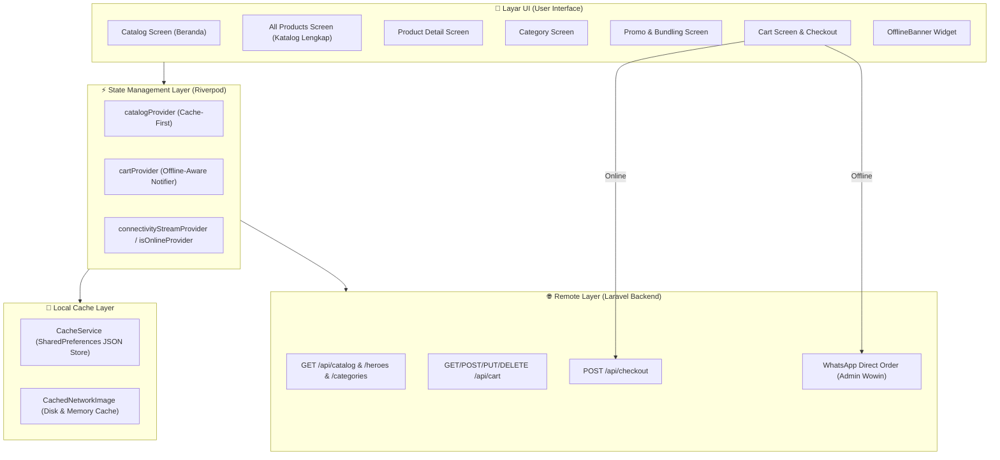

# 📱 PANDUAN & DOKUMENTASI ARSITEKTUR SEMI-OFFLINE (OFFLINE-FIRST) MY WOWIN
**Platform E-Commerce & Membership Terintegrasi (Flutter Mobile & Laravel API)**

---

## 📌 1. LATAR BELAKANG & TUJUAN

Fitur **Semi-Offline (Offline-First / Cache-First Resilience)** diimplementasikan pada aplikasi Flutter **My Wowin** untuk memberikan pengalaman belanja yang cepat, andal, dan tidak terputus bagi para mitra distributor dan pelanggan, bahkan saat berada di wilayah dengan sinyal internet lambat atau terputus total.

### Masalah yang Diselesaikan:
1. **Layar Kosong / Error Saat Sinyal Putus**: Sebelumnya, jika tidak ada koneksi internet, aplikasi langsung menampilkan pesan error (*"Gagal terhubung ke server"* atau blank screen) sehingga produk tidak dapat dilihat.
2. **Gambar Blank / Gagal Dimuat**: Sebelumnya seluruh gambar produk dan banner menggunakan `Image.network` standar yang tidak menyimpan memori di penyimpanan lokal HP (*disk cache*).
3. **Keranjang Belanja Hilang / Macet**: Pengguna tidak dapat menyusun keranjang belanja saat offline.
4. **Checkout Macet Tanpa Alternatif**: Tidak ada penanganan cerdas ketika proses checkout gagal akibat koneksi internet mati.

---

## 🏗️ 2. KOMPONEN ARSITEKTUR SEMI-OFFLINE

### Rincian Modul & File yang Diimplementasikan:

| Modul / File | Lokasi File | Peran & Fungsi |
| :--- | :--- | :--- |
| **`CacheService`** | `lib/core/services/cache_service.dart` | Mengelola serialisasi JSON ke `SharedPreferences` untuk menyimpan cache data katalog produk, kategori, hero banner promo, bundling spesial, keranjang belanja offline, dan profil pengguna. |
| **`ConnectivityService`** | `lib/core/services/connectivity_service.dart` | StreamProvider berbasis `connectivity_plus` yang memantau perubahan status koneksi internet (WiFi, Mobile Data, atau Offline) secara real-time. |
| **`WowinCachedImage`** | `lib/core/widgets/wowin_cached_image.dart` | Widget standar pengganti `Image.network` berbasis `cached_network_image`. Otomatis mengunduh dan menyimpan gambar di memori HP, menampilkan shimmer placeholder, dan fallback error yang elegan saat offline. |
| **`OfflineBanner`** | `lib/core/widgets/offline_indicator.dart` | Widget banner halus (*non-intrusive notification strip*) di bagian atas layar yang otomatis muncul saat koneksi terputus: *"Mode Offline — Menampilkan data katalog tersimpan di HP"*. |
| **`catalogProvider`** | `lib/features/catalog/providers/catalog_provider.dart` | Provider katalog dengan strategi **Stale-While-Revalidate**: Membaca cache lokal terlebih dahulu agar UI muncul instan, lalu memperbarui data di latar belakang saat online. |
| **`CartNotifier`** | `lib/features/cart/providers/cart_provider.dart` | State keranjang yang dapat menyimpan draf keranjang di HP saat offline, mendukung ubah kuantitas (+/-) dan hapus item tanpa koneksi, serta otomatis menyinkronkan ke server saat online kembali. |
| **Smart Checkout Fallback** | `lib/features/cart/screens/cart_screen.dart` | Penanganan checkout cerdas. Jika terjadi kegagalan jaringan saat checkout, sistem menampilkan modal alternatif: **Pesan via WhatsApp Langsung** (dengan rincian barang, total, alamat terformat rapi) atau **Simpan Draf di Keranjang**. |

---

## 🔄 3. ALUR KERJA (DATA FLOW & SCENARIOS)

### Skenario 1: Membuka Aplikasi Saat Online
1. Aplikasi membaca data cache lokal terlebih dahulu (jika ada) sehingga layar beranda langsung tampil tanpa *loading spinner* yang lama.
2. Secara bersamaan di latar belakang, aplikasi mengambil data terbaru dari Laravel API (`/api/catalog`, `/api/heroes`, `/api/categories`, `/api/bundlings`).
3. Begitu data server tiba, UI diperbarui secara halus dan cache lokal langsung diperbarui via `CacheService`.
4. Gambar yang baru dimuat otomatis disimpan ke *disk cache* oleh `WowinCachedImage`.

### Skenario 2: Membuka Aplikasi Saat Offline (Tanpa Sinyal)
1. `catalogProvider` mendeteksi kegagalan jaringan HTTP, lalu otomatis membaca data dari `CacheService.getCatalog()`.
2. Katalog produk, filter kategori, hero banner, dan bundling promo tetap tampil lengkap.
3. Seluruh gambar produk yang pernah dibuka tetap muncul karena tersimpan di memori lokal HP via `CachedNetworkImage`.
4. Banner `OfflineBanner` muncul di atas layar untuk memberitahu pengguna bahwa aplikasi berjalan dalam mode data tersimpan.

### Skenario 3: Menambah Barang & Mengedit Keranjang Belanja Saat Offline
1. Pengguna membuka halaman detail produk dan menekan tombol **"+ Keranjang"**.
2. Jika koneksi terputus, `CartNotifier` otomatis membuat entri draf item lokal dan menyimpannya ke `CacheService.saveOfflineCart(...)`.
3. Total belanja dan subtotal dihitung secara akurat di memori HP.
4. Pengguna dapat menambah kuantitas (+), mengurangi kuantitas (-), atau menghapus item dari keranjang secara bebas.

### Skenario 4: Proses Checkout Saat Offline (Mengapa Butuh Fallback WhatsApp?)
1. **Aturan Keamanan E-Commerce:** Konfirmasi final pembuatan invoice `/api/checkout` tetap memerlukan koneksi ke database pusat untuk mengunci stok (*stock locking*) dan memotong poin loyalitas secara sah.
2. **Solusi Ramah Pengguna saat Offline:**
   - Ketika pengguna menekan *"Konfirmasi & Buat Pesanan"* saat sinyal hilang, aplikasi tidak sekadar memunculkan error merah yang membingungkan.
   - Aplikasi memunculkan BottomSheet interaktif:
     - **Pilihan 1: Kirim Pesanan via WhatsApp Sekarang**: Aplikasi otomatis menyusun draf pesanan lengkap (Nama pembeli, No HP, Alamat pengiriman, Rincian nama produk + qty + harga, Total tagihan, Metode pembayaran yang dipilih, dan Catatan pengiriman), lalu membuka aplikasi WhatsApp langsung ke Admin Wowin. Pesan akan terkirim segera setelah ponsel mendapat sedikit sinyal.
     - **Pilihan 2: Simpan di Draf Keranjang**: Barang belanjaan tetap tersimpan aman di HP agar pengguna bisa melakukan checkout online ketika sinyal stabil.

---

## 🧪 4. PANDUAN PENGUJIAN FITUR (TESTING GUIDE)

Untuk memverifikasi keandalan fitur semi-offline pada aplikasi:

### Tes 1: Pengujian Cache Katalog & Gambar
1. Buka aplikasi dalam kondisi internet aktif (WiFi/Data).
2. Jelajahi halaman Beranda, Kategori, Produk, Promo Bundling, dan Detail Produk.
3. Aktifkan **Mode Pesawat (Airplane Mode)** pada perangkat HP / matikan koneksi internet pada emulator.
4. Tutup aplikasi secara penuh (*kill app / force stop*), lalu buka kembali.
5. **Hasil yang Diharapkan:**
   - Aplikasi terbuka seketika tanpa crash.
   - Banner kuning/oranye `OfflineBanner` muncul di atas layar.
   - Banner hero, kategori produk, daftar harga pcs/karton, dan foto produk tetap tampil jelas dari cache.

### Tes 2: Pengujian Keranjang Belanja Offline
1. Dalam kondisi **Mode Pesawat (Offline)**, buka salah satu produk dari katalog.
2. Pilih satuan pembelian (Pcs / Karton) dan kuantitas, lalu tekan **"+ Keranjang"**.
3. Buka ikon Keranjang Belanja di pojok kanan atas.
4. **Hasil yang Diharapkan:**
   - Item berhasil masuk ke keranjang belanja lokal.
   - Subtotal dan total tagihan terhitung otomatis.
   - Tombol tambah (+), kurang (-), dan hapus item berfungsi lancar.

### Tes 3: Pengujian Fallback Checkout Offline
1. Masih dalam kondisi **Offline**, tekan tombol **"Checkout (X Item)"**.
2. Masukkan catatan atau pilih metode pembayaran di jendela konfirmasi, lalu tekan **"Konfirmasi & Buat Pesanan"**.
3. **Hasil yang Diharapkan:**
   - Muncul modal BottomSheet: *"Koneksi Internet Terputus"*.
   - Saat memilih *"Kirim Pesanan via WhatsApp Sekarang"*, aplikasi WhatsApp otomatis terbuka dengan teks pesanan yang tersusun rapi.

---

## 💡 5. TIPS PEMELIHARAAN & PENGEMBANGAN JANGKA PANJANG

1. **Pembersihan Cache Otomatis:**
   - Saat pengguna melakukan `logout()`, disarankan memanggil `CacheService.clearOfflineCart()` agar draf keranjang tidak tertukar dengan akun mitra lain yang login di HP yang sama.
2. **Kapasitas Cache Disk Gambar:**
   - `cached_network_image` secara bawaan mengelola batas ukuran memori (LRU Cache). Gambar lama yang jarang dibuka akan dibersihkan secara otomatis jika memori HP hampir penuh.
3. **Penambahan Fitur Baru:**
   - Setiap kali membuat layar baru yang menampilkan gambar dari server, selalu gunakan widget `WowinCachedImage(imageUrl: ...)` agar fitur offline cache tetap konsisten di seluruh aplikasi.

---
*Dokumentasi ini dibuat sebagai standar operasional teknis fitur Semi-Offline & Cache Resilience pada ekosistem aplikasi My Wowin.*
