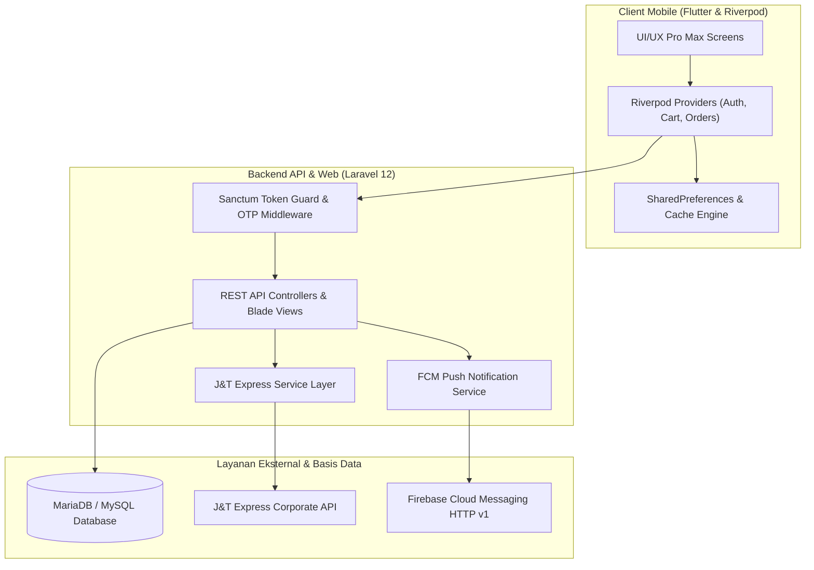

<div align="center">

# 🌿 My Wowin — Official FMCG E-Commerce & Membership Ecosystem
### *Omnichannel Distribution, VIP Tiering System, & J&T Express Logistics API Integration*

[](https://flutter.dev)
[](https://riverpod.dev)
[](https://laravel.com)
[](https://php.net)
[](#-integrasi-logistik-jt-express-api)
[](#-uiux-pro-max-design-system)

<p align="center">
  <b>Platform Perdagangan Digital & Distribusi Resmi PT Wowin Purnomo Putera</b><br>
  Menghubungkan jaringan pabrik kecap dan saos dengan ribuan mitra distributor, toko ritel, dan konsumen akhir. Dilengkapi aplikasi mobile Flutter berperforma tinggi, web portal publik, panel admin multi-cabang, kalkulasi ongkir J&T otomatis, serta program loyalitas VIP berjenjang.
</p>

[Fitur Utama](#-fitur-unggulan-ekosistem) • [Integrasi Logistik J&T](#-integrasi-logistik-jt-express-api) • [Arsitektur UI/UX](#-uiux-pro-max-design-system) • [Tech Stack](#-teknologi--pustaka-inti) • [Panduan Setup](#-panduan-instalasi-lokal)

---

</div>

## 🌟 Fitur Unggulan Ekosistem

### 1. Aplikasi Mobile Belanja (Flutter & Riverpod)
- **State Management Terisolasi (Riverpod):** Arsitektur state modular tanpa boilerplate berlebih, menjamin performa rendering 60 FPS di perangkat low-end maupun flagship.
- **Keranjang Belanja Offline-First:** Item belanja tersimpan persisten di storage lokal, mencegah hilangnya data keranjang saat terjadi gangguan jaringan seluler.
- **Push Notification Transaksional (FCM v1):** Pembaruan instan untuk status konfirmasi pesanan, resi pengiriman, promo flash sale, dan pengingat klaim poin harian.
- **Customer Support Live Chat:** Modul interaksi langsung antara pengguna dengan customer service perusahaan.

### 2. Program Loyalitas & Membership (VIP Tiering)
- **Tingkat Kemitraan Dinamis:** Akreditasi berjenjang (Bronze, Silver, Gold, Platinum, Diamond) berdasarkan akumulasi volume belanja distributor.
- **Login Streak & Daily Point Claim:** Sistem reward interaktif yang mendorong retensi harian pengguna aplikasi.
- **Penukaran Produk & Hadiah:** Poin reward dapat ditukarkan langsung dengan stok produk gratis atau merchandise eksklusif.

### 3. Portal Web Publik & Panel Multi-Cabang (Laravel 12)
- **Multi-Branch Order Distribution:** Routing otomatis pesanan ke 9 kantor cabang distribusi terdekat (Trenggalek, Kediri, Madiun, Solo, Jogja, Cirebon, Kudus, Bogor, Serang).
- **Cetak Faktur & Invoice Otomatis:** Pembuatan berkas e-Nota dan Invoice format PDF & Excel untuk kemudahan administrasi kasir cabang.
- **Verifikasi Autentikasi OTP Email:** Registrasi dan pemulihan akun yang aman menggunakan verifikasi kode OTP berbasis time-expiry via server SMTP.
- **SEO & Structured Data:** Integrasi Google Schema.org JSON-LD dan Google Maps Reviews untuk optimalisasi pencarian produk lokal.

---

## 🚚 Integrasi Logistik J&T Express API

Sistem backend My Wowin terhubung langsung dengan gateway korporat **J&T Express Logistics**:
- **Automatic AWB / Resi Generation:** Nomor resi resmi langsung terbit saat admin menyetujui pesanan.
- **Real-Time Tracking Engine:** Pelacakan checkpoint kurir secara live dari dalam aplikasi tanpa membuka website ekspedisi pihak ketiga.
- **Kalkulasi Tarif Otomatis:** Perhitungan ongkir real-time dengan skema tarif khusus *VIP Jawara Jatim/Madura* dan *Reguler Luar Jawa*.
- **Pembatalan Terintegrasi:** Sinkronisasi pembatalan resi otomatis ke server J&T jika transaksi dibatalkan oleh operator.

---

## 🎨 UI/UX Pro Max Design System

Antarmuka Flutter My Wowin dikalibrasi mengikuti pedoman **UI/UX Pro Max**:

```
┌────────────────────────────────────────────────────────────────────────┐
│ UI/UX PRO MAX SPECIFICATION                                            │
├─────────────────────────────────┬──────────────────────────────────────┤
│ 📐 Typography Scale             │ Outfit (Display w800, Body w400/500) │
│ 🛡️ Text Scaling Guard           │ Clamped (0.85x – 1.15x Max Factor)   │
│ 🪟 Header & Glassmorphism       │ 56dp / 64dp + Backdrop Blur σ: 16.0  │
│ 👆 Touch Target Ergonomics      │ Min 44x44 dp (Zero misclick layout)  │
│ 🫧 Card Elevation & Shadows      │ Surface Border 0.08a + Blur 12dp     │
│ ⛵ Floating Navigation Pill      │ Scaffold extendBody + Bottom 120dp   │
└─────────────────────────────────┴──────────────────────────────────────┘
```

- **Perlindungan Skala Teks:** Mencegah elemen UI tertabrak atau overflow jika pengguna mengubah skala font HP.
- **Frosted Glass Navigation:** Navigasi bawah melayang (*Floating Island*) dengan blur halus yang memberi ruang pandang maksimal pada katalog produk.

---

## 🏗️ Arsitektur dan Alur Data



---

## 🛠️ Teknologi & Pustaka Inti

| Sektor | Teknologi | Kegunaan |
| :--- | :--- | :--- |
| **Mobile Client** | **Flutter (Dart ^3.12)** | Aplikasi mobile Android & iOS berstandar UI/UX Pro Max |
| **State Management** | **Flutter Riverpod** | Arsitektur state terisolasi, reaktif, dan testable |
| **Backend & Web** | **Laravel 12 (PHP 8.2+)** | RESTful API, web e-commerce, dan panel super admin |
| **Database** | **MariaDB / MySQL 8.0** | Basis data relasional dengan indeks performa transaksi tinggi |
| **Ekspedisi Logistik** | **J&T Express API** | Integrasi pemesanan, pelacakan resi, dan tarif VIP logistik |
| **Notifikasi** | **Firebase Cloud Messaging (FCM)** | Notifikasi push transaksional real-time ke perangkat |
| **Cetak Dokumen** | **barryvdh/laravel-dompdf** | Ekspor e-Nota, struk, dan laporan pesanan cabang format PDF |
| **Spreadsheet** | **maatwebsite/excel** | Ekspor rekap omzet dan mutasi barang format Excel |

---

## 📁 Struktur Direktori

```text
MYWOWIN/
├── My_Wowin (flutter)/            # Aplikasi Mobile (Android & iOS)
│   ├── lib/
│   │   ├── core/                  # Theme, Constants, Utils, & UI UX Pro Max Widgets
│   │   ├── features/
│   │   │   ├── auth/              # Layar Login, Registrasi OTP, Reset Password
│   │   │   ├── cart/              # Keranjang Offline-First & Checkout
│   │   │   ├── catalog/           # Katalog Produk, Kategori, & Promo Bundling
│   │   │   ├── chat/              # Layar Live Chat Customer Service
│   │   │   ├── order/             # Riwayat Pesanan & Live Tracking J&T
│   │   │   └── splash/            # Splash Screen Beranimasi
│   │   └── main.dart
│   └── pubspec.yaml
├── public_html (web fronted + backend)/  # Web Portal & REST API (Laravel 12)
│   ├── app/
│   │   ├── Http/Controllers/Api/  # REST API untuk Flutter
│   │   ├── Http/Controllers/Admin/# Controller Panel Admin Cabang & Superadmin
│   │   ├── Models/                # Eloquent Models (Order, Product, Review, Branch)
│   │   └── Services/              # Integrasi JntService & FCM Service
│   ├── config/                    # Konfigurasi mail, jnt, database, & session
│   ├── database/migrations/       # Skema Relasional Database
│   ├── resources/views/           # Blade Views (Publik, Admin, Superadmin)
│   └── routes/                    # Definisi Route Web & API
└── docker/                        # Konfigurasi Docker Local Environment
```

---

## 💻 Panduan Instalasi Lokal

### Prasyarat:
- **PHP** >= 8.2 (ekstensi: `pdo_mysql`, `curl`, `mbstring`, `gd`, `zip`, `openssl`)
- **Composer** >= 2.x
- **Node.js** >= 18.x & NPM
- **Flutter SDK** >= 3.x
- **MySQL / MariaDB**

### 1. Setup Backend API & Web (Laravel 12)
```bash
# Masuk ke direktori web & backend
cd "public_html (web fronted + backend)"

# Install dependensi PHP dan Node
composer install
npm install

# Siapkan berkas environment lokal
cp .env.example .env
php artisan key:generate

# Konfigurasikan parameter DB pada .env, lalu jalankan migrasi:
php artisan migrate --seed

# Hubungkan symbolic link storage:
php artisan storage:link

# Jalankan server lokal & asset bundler:
composer run dev
```

### 2. Setup Mobile Application (Flutter)
```bash
# Masuk ke direktori mobile app
cd "My_Wowin (flutter)"

# Ambil dependensi Flutter
flutter pub get

# Jalankan code analysis
flutter analyze

# Jalankan aplikasi pada emulator atau perangkat fisik:
flutter run
```

---

## 🔒 Standar Keamanan & Zero-Trust Architecture
- **Environment Isolation:** Semua parameter kredensial API ekspedisi, SMTP, dan database dikelola via `.env` tanpa pernah tersimpan pada repositori publik.
- **Token Expiry & Scopes:** Otentikasi mobile diamankan dengan Laravel Sanctum Personal Access Token yang memiliki masa kedaluwarsa berkala.
- **Strict Role-Based Access Control (RBAC):** Pemisahan hak akses mutlak antara Superadmin, Admin Cabang, dan Member Publik.

---

<div align="center">
  <sub>PT Wowin Purnomo Putera — Menghadirkan Cita Rasa Nusantara Terbaik. Seluruh hak cipta dilindungi.</sub>
</div>
